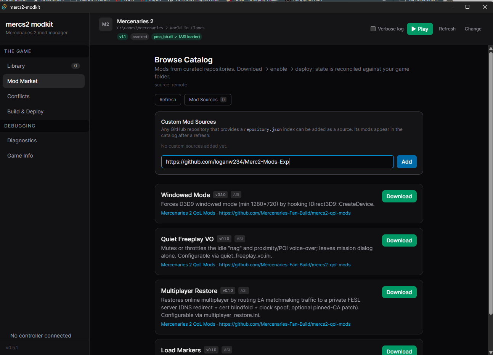
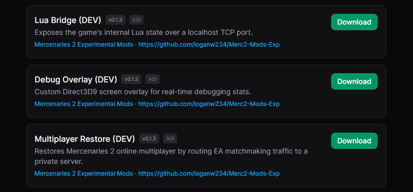

# Mercenaries 2 Experimental Mods

> [!NOTE]
> This repository is dedicated to **in-development** mods, tools, and plugins. For stable, fully tested releases, please visit the main repository: [mercs2-qol-mods](https://github.com/Mercenaries-Fan-Build/mercs2-qol-mods).

A collection of experimental mods for **Mercenaries 2: World in Flames** (PC).

## Connecting to the Modkit

This repository supports live updates directly through the [Modkit](https://github.com/Mercenaries-Fan-Build/mercs2-modkit). This is the preferred method for acquiring and updating these experimental mods:

1. Open the Modkit.
2. Navigate to the **Mod Market**.
3. Press **Mod Sources**.
4. Enter the repository URL: `https://github.com/loganw234/Merc2-Mods-Exp`
5. Press **Add**.

Once added, the experimental development builds of the mods (marked with a `(DEV)` suffix) will become available to download and enable in your **Mod Market**:

## License

MIT — see [LICENSE](LICENSE).
